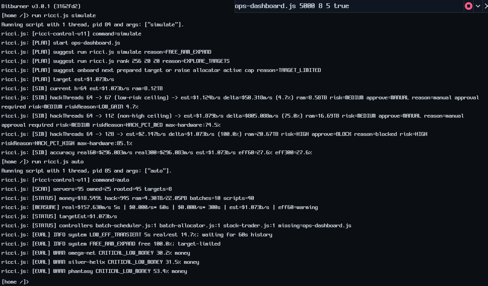
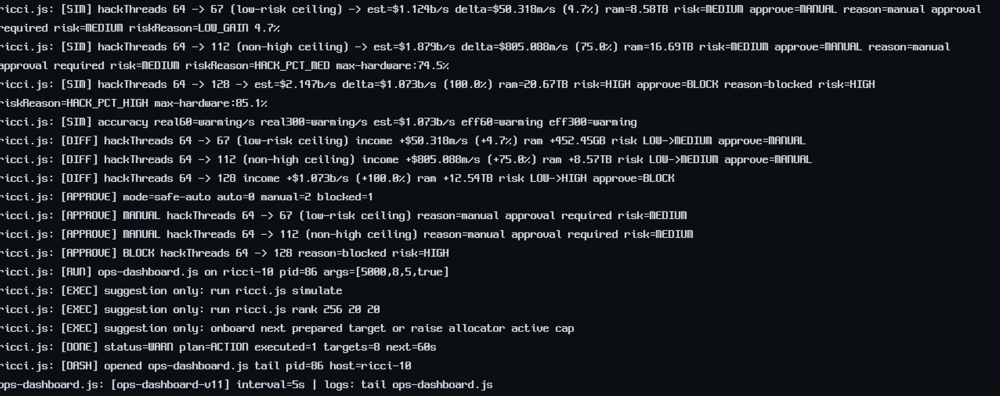
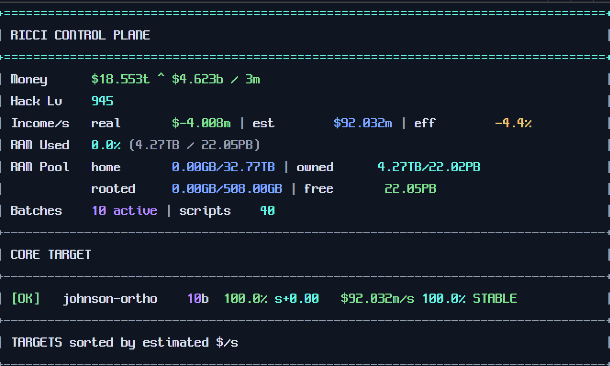
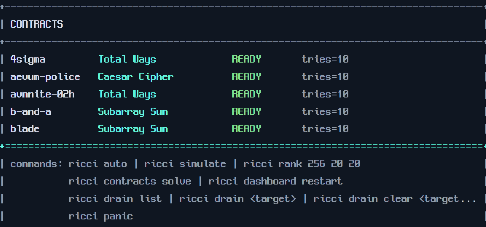
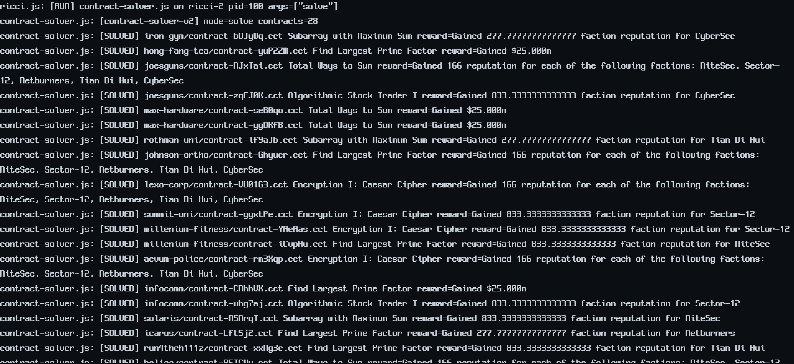

# Bitburner KR Patch Lab

Bitburner 스팀판에 대한 한국어 표시 패치를 작은 범위부터 검증하기 위한 작업 루트입니다.

## Bitburner란?

Bitburner는 해킹을 소재로 한 프로그래밍 idle/RPG 게임입니다. 플레이어는 JavaScript 기반 스크립트를 작성해 서버를 해킹하고, 자금을 벌고, 장비와 Augmentation을 확장하며 더 깊은 네트워크와 BitNode를 공략합니다. 이 패치 랩은 게임의 명령어, API, 고유명사는 최대한 보존하면서 플레이 중 읽게 되는 설명문과 UI 라벨을 한국어로 바꾸는 것을 목표로 합니다.

## 플레이 화면 예시

## 목표

- 게임 고유명사, API 이름, 명령어, 내부 식별자는 유지한다.
- 설명문, 툴팁, 효과 설명, 스탯 라벨처럼 플레이어가 읽는 문장 중심으로 한글화한다.
- Steam 업데이트 이후에도 재적용할 수 있도록 직접 수정 내역보다 패처와 치환표를 남긴다.
- 한글 폰트는 네오둥근모를 우선 사용한다.

## 현재 확인된 환경

- Bitburner 설치 경로: `D:\SteamLibrary\steamapps\common\Bitburner`
- 앱 구조: Electron 앱
- 게임 번들: `resources\app\dist\main.bundle.js`
- 원본 소스맵: `resources\app\dist\main.bundle.js.map`
- HTML 엔트리: `resources\app\index.html`
- 폰트 파일: `assets\fonts\neodgm.ttf` 로컬 보관, git 추적 제외

## 현재 상태

- Hacknet Nodes 설명문 3개 한글화 성공
- NeoDunggeunmo 폰트 로드 및 force CSS 적용 성공
- 전체 UI는 NeoDunggeunmo를 유지하고, Monaco 코드 에디터만 기존 코딩 폰트 계열로 예외 처리 완료
- Phase 1 패처는 dry-run 기본값, `expectedCount`, `allowRemainingSource`, `patch-state.json` 기록을 필수 안전장치로 설계
- Augmentation 효과 라벨 1차/2차 패치 적용 및 화면 검증 완료
- Terminal `analyze` 출력 라벨 패치 적용 및 화면 검증 완료
- Hacknet 요약 박스/구매 버튼 라벨 패치 적용 및 화면 검증 완료
- Hacknet Node 카드 라벨/최대치 버튼 패치 적용 및 화면 검증 완료
- Options 창 라벨/작업 버튼/주요 툴팁 설명문 패치 적용 및 잔여 4곳 화면 확인 보정 완료
- Active Scripts 라벨/설명문/생산 통계 텍스트 패치 적용 및 화면 검증 완료
- Dark Net 화면 라벨/상태/주요 툴팁 패치 적용 및 화면 검증 완료
- Faction work 라벨/메인 잔여/짧은 소개문 패치 적용 및 화면 검증 완료
- Faction Augmentations 구매 화면 라벨/설명문 패치 적용 및 화면 검증 완료
- Documentation 홈/목차와 Beginner's guide 전체 번역 패치 적용 및 화면 검증 완료

자세한 실험 진행 상황과 스크린샷은 [`docs/08_experiment_log.md`](docs/08_experiment_log.md)를 본다.

## 문서

- `docs/01_research_notes.md`: 조사한 사실과 근거
- `docs/02_patch_direction.md`: 패치 방향과 금지 구역
- `docs/03_roadmap.md`: 단계별 로드맵
- `docs/04_translation_policy.md`: 번역 정책과 용어 기준
- `docs/05_first_patch_result.md`: 첫 Hacknet 설명문 패치 결과
- `docs/06_patcher_design.md`: Phase 1 패처 안전장치 설계
- `docs/07_font_experiment.md`: NeoDunggeunmo 폰트 실험 상세
- `docs/08_experiment_log.md`: 실험 진행 상황과 스크린샷 로그
- `docs/changelog.md`: 변경 기록

## 다음 실험 후보

1. Dark Net 인증/상세 모달 잔여(`Logs scraped via`, `Hint:`) 별도 보강.
2. Faction 긴 lore/rumor 문구 sweep.
3. 개별 Augmentation lore/Grafting 구매 화면 보강.
4. Hacknet 관련 나머지 설명/툴팁 확장.
5. 다른 Documentation 문서 섹션 단위 확장.
6. 새 화면 잔여 발견 시 보정 manifest 추가.

