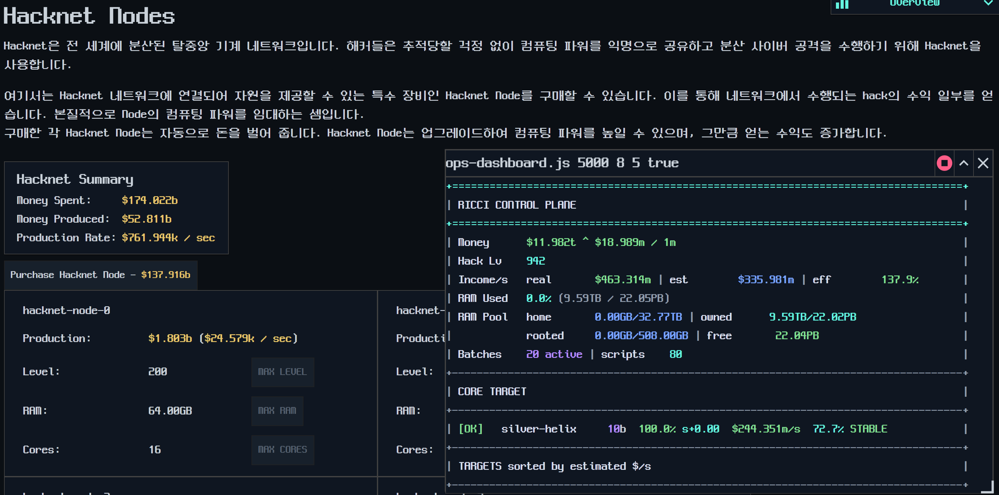

# 07. NeoDunggeunmo 폰트 실험

작성일: 2026-06-29

## 목적

한글 번역문이 깨지지 않는 수준을 넘어서, Bitburner의 터미널/모노스페이스 감성과 맞는 픽셀 계열 한글 폰트를 우선 적용할 수 있는지 확인한다.

## 적용 방식

대상 파일:

- `D:\SteamLibrary\steamapps\common\Bitburner\resources\app\index.html`
- `D:\SteamLibrary\steamapps\common\Bitburner\resources\app\dist\main.bundle.js`
- `D:\SteamLibrary\steamapps\common\Bitburner\resources\app\dist\fonts\neodgm.ttf`

실험 내용:

1. `C:\Users\user\Desktop\neodgm.ttf`를 앱 리소스의 `dist/fonts/neodgm.ttf`로 복사한다.
2. `index.html`의 `<style>` 안에 `@font-face`를 추가한다.
3. `main.bundle.js`에 있는 기본 font stack `JetBrainsMono, "Courier New", monospace` 4곳을 `NeoDunggeunmo, JetBrainsMono, "Courier New", monospace`로 치환한다.

## 통제 조건

- 번들 치환 전 원문 font stack의 개수가 정확히 4개인지 검사했다.
- 이미 `NeoDunggeunmo`가 들어간 상태면 중복 삽입하지 않도록 했다.
- `index.html`도 `font-family: "NeoDunggeunmo"` 존재 여부를 먼저 검사했다.
- 적용 전 `main.bundle.js`, `index.html` 백업을 `backups/`에 남겼다.

## 현재 결과

패치 적용 결과:

- 번들 font stack 치환: 4건
- `index.html` `@font-face` 삽입: 1건
- 폰트 복사 위치: `resources/app/dist/fonts/neodgm.ttf`

게임을 재시작한 뒤 다음을 확인한다.

- Hacknet 설명문의 한글 자형이 NeoDunggeunmo로 보이는지
- 영문/숫자 폭이 UI를 과도하게 밀지 않는지
- 터미널, 코드 에디터, 버튼, 드롭다운에서 글자 잘림이 없는지
- Monaco 에디터가 별도 fontFamily를 강제하는지

## 패처 반영 방향

Phase 1 패처에서는 폰트 적용을 문자열 번역 패치와 별도 patchId로 분리한다.

권장 patchId:

- `font.neodgm.v1`

권장 manifest 검증:

- `expectedCount: 4`
- `allowRemainingSource: false`
- `copy` 작업은 `sourceExists`, `targetHashAfter` 기록
- `index.html` 삽입은 anchor 기반으로 처리하되 anchor가 0개 또는 2개 이상이면 중단

## 복구

폰트 실험을 되돌릴 때는 `backups/`의 `index.html.before-neodgm-font-*`, `main.bundle.js.before-neodgm-font-*`를 원래 위치로 복사한다. `dist/fonts/neodgm.ttf`는 삭제해도 되지만, 번들/HTML이 먼저 복구되어야 한다.

## 2026-06-29 추가 실험: force CSS

사용자 확인 결과 1차 실험은 화면상 폰트 변화가 보이지 않았다. 파일 변경 자체는 확인되었다.

확인된 사실:

- `@font-face`는 `index.html`에 존재한다.
- `main.bundle.js`의 기본 font stack 4곳은 `NeoDunggeunmo` 우선으로 바뀌었다.
- `neodgm.ttf` 내부 family 이름은 `NeoDunggeunmo`가 맞다.

따라서 현재 가장 유력한 원인은 기존 설정값 또는 컴포넌트 스타일이 기본 font stack 변경을 우회하는 것이다.

2차 실험으로 `index.html`에 다음 방향의 강제 CSS를 추가했다.

- `--bb-kr-font-family` CSS 변수를 정의한다.
- `html body #root *:not(svg):not(path)`에 `font-family: var(--bb-kr-font-family) !important`를 적용한다.
- `input`, `textarea`, `button`, `pre`, `code`, `.monaco-editor`에도 같은 font family를 강제한다.

이 실험은 렌더링 여부를 확인하기 위한 강한 패치다. 성공하면 Phase 1 패처에서는 사용자 설정을 보존하는 더 좁은 selector로 줄이는 것을 검토한다.

## 2026-06-29 추가 실험: fallback order 조정

force CSS 실험은 성공했지만, `NeoDunggeunmo`를 font stack 맨 앞에 두면 한글뿐 아니라 영문/숫자/기존 UI 전체가 네오둥근모로 렌더링된다.

패치 목적이 "한글 표시 품질 개선"이라면 전체 UI 폰트 교체보다 다음 순서가 더 현실적이다.

- `JetBrainsMono, NeoDunggeunmo, "Courier New", monospace`

이 순서는 영문/숫자/기존 ASCII UI는 JetBrainsMono를 우선 사용하고, JetBrainsMono가 지원하지 않는 한글 글리프만 NeoDunggeunmo fallback으로 렌더링하게 만든다.

적용 결과:

- `main.bundle.js`의 `NeoDunggeunmo, JetBrainsMono, ...` 4곳을 `JetBrainsMono, NeoDunggeunmo, ...`로 변경했다.
- `index.html`의 `--bb-kr-font-family`도 같은 fallback 순서로 변경했다.

다음 확인 포인트:

- `Hacknet Nodes`, `Hacknet Node`, 숫자, 스크립트 출력이 기존 JetBrainsMono에 가깝게 돌아오는지
- 한글 설명문만 NeoDunggeunmo 자형으로 표시되는지
- 한글/영문 혼합 줄에서 baseline이나 글자 폭이 크게 어긋나지 않는지
