# 08. 실험 진행 로그

Bitburner KR 패치의 실제 실험 결과와 스크린샷을 모아 두는 문서다. README에는 현재 상태와 링크만 유지하고, 세부 시행착오와 판단 근거는 이 문서에 기록한다.

## 현재 상태 요약

완료:

- Hacknet Nodes 소개문
- NeoDunggeunmo 전체 UI 폰트 적용
- Augmentation 효과 라벨 1차/2차
- Terminal `analyze` 라벨
- Hacknet 요약/Node 카드 라벨
- Options 라벨/버튼/주요 툴팁

진행 후보:

- Dark Web/Active Scripts 단발 툴팁
- Active Scripts 라벨
- Monaco 에디터 폰트 예외 처리

검증 원칙:

- broad 치환 금지
- `sourceCount`/`targetCount` 확인
- dry-run -> apply -> 재 dry-run 확인
- 실제 화면 스크린샷으로 최종 검증

| 영역 | Manifest | 검증 상태 | 스크린샷 | 남은 것 |
| --- | --- | --- | --- | --- |
| Hacknet Nodes 소개문 | `patches/hacknet_nodes_intro_small.json` | 화면 검증 완료 | `screenshot/첫 출력.png` | 없음 |
| NeoDunggeunmo 폰트 | `patches/font_neodgm_experiment.json` | force CSS 화면 검증 완료 | `screenshot/폰트변경.png` | Monaco 에디터 예외 처리 후보 |
| Augmentation 효과 라벨 1차 | `patches/augmentation_effects_small.json` | 부분 성공 후 2차로 보정 | `augmentation_crtx42_success.png`, `augmentation_neurotrainer_success.png` | 2차에서 처리 완료 |
| Augmentation 효과 라벨 2차 | `patches/augmentation_effects_individual.json` | 화면 검증 완료 | `augmentation_synaptic_success.png`, `augmentation_synthetic_nerve_success.png`, `augmentation_cranial_signal_processors_success.png` | 없음 |
| Terminal `analyze` 라벨 | `patches/terminal_analyze_labels.json` | 화면 검증 완료 | `terminal_analyze_home_success.png` | 다른 서버 상태 케이스 추가 후보 |
| Hacknet 요약 라벨 | `patches/hacknet_summary_labels.json` | 화면 검증 완료 | `hacknet_summary_success.png` | 없음 |
| Hacknet Node 카드 라벨 | `patches/hacknet_node_card_labels.json` | 화면 검증 완료 | `hacknet_node_card_success.png` | 없음 |
| Options System 라벨 | `patches/options_system_labels.json` | 후속 Options sweep으로 완료 | `options_system_success.png` | 없음 |
| Options 라벨/버튼/툴팁 | `options_remaining_texts.json`, `options_sidebar_buttons.json`, `options_keybinding_texts.json`, `options_tooltip_completion.json`, `options_tooltip_final_sweep.json`, `options_final_visual_fixes.json` | 화면 검증 완료 | `options_interface_final_success.png` | 없음 |
| Phase 1 패처 | `scripts/apply-patch.ps1`, `scripts/revert-patch.ps1` | clean GameRoot apply/revert 통제 검증 완료, 로컬 화면 기록 대기 | 스크린샷 대기 | 로컬 실행 화면 캡처 추가 |

### Phase 1 패처 로컬 화면 검증 대기

남길 스크린샷 후보:

- clean GameRoot에서 `apply-patch.ps1` dry-run 출력
- clean GameRoot에서 `apply-patch.ps1 -Apply` 적용 완료 출력
- `patch-state.json`에 `patchId`, `targetHashBefore`, `targetHashAfter`, `backupPath`가 기록된 화면
- `revert-patch.ps1` 복구 완료 출력
- 복구 후 원문/target count가 기대대로 돌아온 확인 출력

판단 기준:

- 패처 기능은 clean GameRoot apply/revert 통제 실험으로 이미 검증했다.
- 다만 실제 로컬 실행 화면 스크린샷이 없으므로, 문서상 최종 화면 검증은 대기 상태로 둔다.
- 스크린샷이 추가되면 `screenshot/patcher_apply_revert_success.png` 같은 이름으로 연결하고 표의 스크린샷/검증 상태를 갱신한다.

## 2026-06-29 - Hacknet Nodes 설명문 한글화

목표:

- 게임 고유명사와 UI 식별자는 유지한다.
- 설명문 3개만 작은 범위로 한글화한다.
- 원문 치환이 실제 게임 화면에 반영되는지 확인한다.

결과:

- `resources/app/dist/main.bundle.js`에서 Hacknet Nodes 소개 문장 3개를 치환했다.
- `Hacknet`, `Hacknet Node`, `Node`, `hack`은 유지했다.
- 게임 재실행 후 화면 반영을 확인했다.

스크린샷:

관련 문서:

- `docs/05_first_patch_result.md`
- `patches/hacknet_nodes_intro_small.json`

## 2026-06-29 - NeoDunggeunmo 폰트 1차 실험

목표:

- 한글 표시 품질을 위해 NeoDunggeunmo를 앱 리소스로 로드한다.
- 번들 기본 font stack 앞에 NeoDunggeunmo를 추가한다.

결과:

- `dist/fonts/neodgm.ttf` 복사 성공
- `index.html` `@font-face` 삽입 성공
- `main.bundle.js` font stack 4곳 치환 성공
- 하지만 화면 확인 결과 실제 화면 폰트 변화가 보이지 않았다.

판단:

- 파일 변경은 되었지만 렌더링 변경은 실패했다.
- TTF 내부 family 이름은 `NeoDunggeunmo`로 확인되어 이름 불일치 가능성은 낮다.
- 기존 설정값 또는 컴포넌트 스타일이 기본 font stack 변경을 우회하는 것으로 판단했다.

## 2026-06-29 - NeoDunggeunmo force CSS 실험

목표:

- `index.html`에서 `#root` 하위 텍스트에 `font-family`를 강제해 실제 렌더링 변경 가능성을 확인한다.

결과:

- force CSS 적용 후 게임 전체 UI가 NeoDunggeunmo로 바뀌었다.
- Hacknet 화면, floating script window, ASCII 대시보드까지 일관되게 픽셀 폰트 분위기가 적용되었다.

스크린샷:

판단:

- force CSS는 성공했다.
- 처음에는 전체 UI 폰트 변경이 과하다고 판단해 `JetBrainsMono, NeoDunggeunmo, "Courier New", monospace` fallback 순서를 실험 후보로 정리했다.
- 이후 스크린샷을 다시 보고, NeoDunggeunmo의 영문/숫자까지 Bitburner 분위기에 잘 맞는다고 판단했다.
- 현재 기본 후보는 전체 UI NeoDunggeunmo 적용이다.
- 단, 긴 코드 편집 작업이 많은 Monaco 에디터는 추후 예외 처리 후보로 남긴다.

관련 문서:

- `docs/07_font_experiment.md`
- `patches/font_neodgm_experiment.json`

## 현재 임시 결론

- 텍스트 한글화는 번들 직접 치환으로 작동한다.
- 폰트는 단순 font stack 치환만으로는 실제 렌더링에 반영되지 않을 수 있다.
- `index.html` force CSS는 실제 렌더링 변경에 성공했다.
- Phase 1 패처는 문자열 치환과 폰트 패치를 별도 patchId로 분리해야 한다.
- 폰트 패치는 전체 UI 적용을 기본값으로 두되, 에디터 예외 처리를 옵션으로 둔다.

## 2026-06-29 - Augmentation 효과 라벨 소형 패치

목표:

- Augmentation 이름이나 내부 multiplier 키는 건드리지 않는다.
- `src/Augmentation/Augmentation.ts`에서 생성되는 효과 설명 라벨만 번역한다.
- 광범위한 `hacking skill` 치환 대신 minified bundle의 Augmentation 전용 조각만 치환한다.

적용한 번역:

- `Effects:` -> `효과:`
- `all skills` -> `모든 스킬`
- `hacking skill` -> `해킹 스킬`
- `combat skills` -> `전투 스킬`
- `exp for all skills` -> `모든 스킬 경험치`
- `hacking exp` -> `해킹 경험치`
- `combat exp` -> `전투 경험치`

검증:

- 각 source 조각은 적용 전 정확히 1회 매치되었다.
- `scripts/apply-patch.ps1 -Patch patches/augmentation_effects_small.json -Apply`로 적용했다.
- 적용 후 source 조각 7개는 모두 0회, target 조각 7개는 모두 1회 확인했다.
- `patch-state.json`에 `augmentation_effects_small` applied entry 7개가 기록되었다.

스크린샷:

성공 사례 1: `CRTX42-AA`

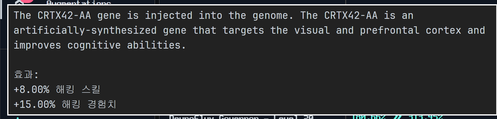

관찰:

- `Effects:`가 `효과:`로 정상 표시된다.
- `hacking skill`이 `해킹 스킬`로 표시된다.
- `hacking exp`가 `해킹 경험치`로 표시된다.
- Augmentation 이름 `CRTX42-AA`와 설명문은 원문 그대로 유지되었다.
- 줄바꿈, 숫자, `%` 포맷은 깨지지 않았다.

성공 사례 2: `Neurotrainer I`

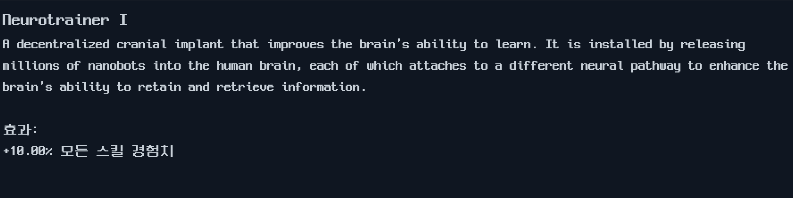

관찰:

- `exp for all skills`가 `모든 스킬 경험치`로 정상 표시된다.
- `%`와 수치 포맷은 유지되었다.
- 전체 UI NeoDunggeunmo 폰트와 한글 라벨 조합이 자연스럽다.
- 이 화면은 이번 패치가 “공통 경험치 라벨”에도 적용된다는 증거다.

부분 성공/남은 범위 1: synaptic potentiation 계열

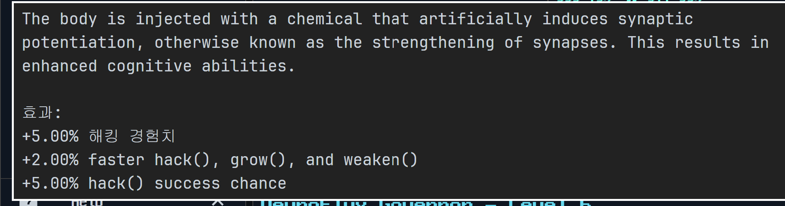

관찰:

- `Effects:` -> `효과:` 성공
- `hacking exp` -> `해킹 경험치` 성공
- `faster hack(), grow(), and weaken()`은 영어로 남았다.
- `hack() success chance`도 영어로 남았다.

판단:

- 이 화면은 패치 실패가 아니라 “1차 scope 밖 문자열”이 남은 사례다.
- 이번 manifest는 `src/Augmentation/Augmentation.ts`의 스킬/경험치 공통 라벨만 목표로 했다.
- `faster hack(), grow(), and weaken()`와 `hack() success chance`는 같은 함수의 다른 multiplier 라벨로 보이며, 다음 Augmentation 패치에서 별도 expectedCount로 다루는 것이 맞다.
- API 표기인 `hack()`, `grow()`, `weaken()`은 유지해야 한다.

부분 성공/남은 범위 2: Synthetic Nerve Enhancement 계열

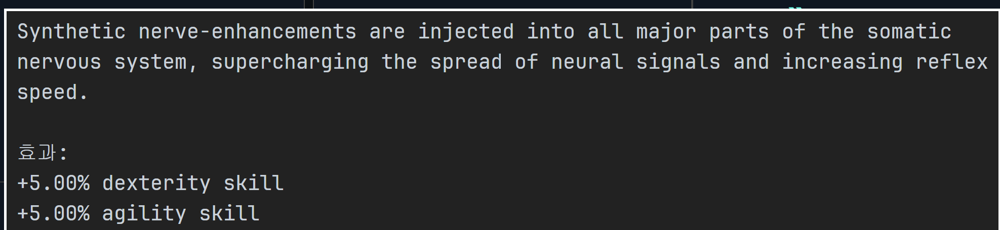

관찰:

- `Effects:` -> `효과:` 성공
- `dexterity skill`, `agility skill`은 영어로 남았다.

판단:

- 이 역시 패치 실패가 아니라 의도적으로 남겨둔 개별 스킬 라벨이다.
- 1차 manifest는 `hacking skill`, `combat skills`, `all skills` 같은 대표/공통 라벨만 처리했다.
- 다음 후보는 `strength skill`, `defense skill`, `dexterity skill`, `agility skill`, `charisma skill` 및 각 exp 라벨이다.
- 단순 `dexterity skill` broad 치환은 다른 문맥을 건드릴 수 있으므로, 이번과 같이 `r(e.dexterity-1)} dexterity skill` 뒤에 template literal 종료가 붙는 Augmentation 전용 minified 조각으로 잡아야 한다.

실패/한계 정리:

- 실패한 것은 패처나 적용 절차가 아니라 번역 범위다.
- source 0회/target 1회 검증은 통과했으므로 manifest에 들어간 7개 조각은 정상 적용되었다.
- 화면 검증 결과, 이번 patch scope에 포함되지 않은 개별 효과 라벨이 남아 있음을 확인했다.
- 다음 패치에서는 “Augmentation 효과 라벨 2차”로 개별 스킬/경험치/해킹 액션 라벨을 추가한다.

다음 후보:

- `strength skill` -> `힘 스킬`
- `defense skill` -> `방어 스킬`
- `dexterity skill` -> `민첩 스킬`
- `agility skill` -> `기동 스킬`
- `charisma skill` -> `카리스마 스킬`
- `strength exp` -> `힘 경험치`
- `defense exp` -> `방어 경험치`
- `dexterity exp` -> `민첩 경험치`
- `agility exp` -> `기동 경험치`
- `charisma exp` -> `카리스마 경험치`
- `faster hack(), grow(), and weaken()` -> `hack(), grow(), weaken() 속도 증가`
- `hack() success chance` -> `hack() 성공 확률`

## 2026-06-29 - Augmentation 효과 라벨 2차 패치

목표:

- 1차 패치 후 스크린샷에서 남은 개별 효과 라벨을 처리한다.
- 같은 영어 문장이 여러 문맥에 존재하는 경우 broad 치환을 피한다.
- `hack()`, `grow()`, `weaken()` 같은 API 표기는 유지한다.

적용한 번역:

- `strength skill` -> `힘 스킬`
- `defense skill` -> `방어 스킬`
- `dexterity skill` -> `민첩 스킬`
- `agility skill` -> `기동 스킬`
- `charisma skill` -> `카리스마 스킬`
- `strength exp` -> `힘 경험치`
- `defense exp` -> `방어 경험치`
- `dexterity exp` -> `민첩 경험치`
- `agility exp` -> `기동 경험치`
- `charisma exp` -> `카리스마 경험치`
- `faster hack(), grow(), and weaken()` -> `hack(), grow(), weaken() 속도 증가`
- `hack() success chance` -> `hack() 성공 확률`

통제 확인:

- 개별 스킬/경험치 라벨 10개는 적용 전 각각 정확히 1회 매치되었다.
- `hack() success chance`도 Augmentation 전용 조각에서 정확히 1회 매치되었다.
- `faster hack(), grow(), and weaken()` 원문은 전체 번들 기준 3회였다.
- 3회 중 하나는 Augmentation 효과, 하나는 다른 효과 템플릿, 하나는 IPvGO 보너스 설명이었다.
- 따라서 실제 source는 `r(e.hacking_speed-1)} faster hack(), grow(), and weaken()`처럼 Augmentation 전용 multiplier 문맥을 포함해 잡았다.

적용 결과:

- `scripts/apply-patch.ps1 -Patch patches/augmentation_effects_individual.json` dry-run 통과
- `scripts/apply-patch.ps1 -Patch patches/augmentation_effects_individual.json -Apply` 적용 성공
- 적용 후 12개 source 조각은 모두 0회 확인
- 적용 후 12개 target 조각은 모두 1회 확인
- `patch-state.json`에 `augmentation_effects_individual` applied entry가 기록되었다.

판단:

- 1차 스크린샷에서 보였던 `dexterity skill`, `agility skill`, `faster hack(), grow(), and weaken()`, `hack() success chance` 잔류는 패치 범위 문제였고, 2차 manifest로 해결했다.
- 실제 게임 화면으로 2차 패치 반영을 확인했다.
- 다음 단계는 Terminal analyze 라벨 패치다.

## 2026-06-29 - Augmentation 효과 라벨 2차 화면 검증

목표:

- 2차 패치가 실제 게임 UI에 반영되는지 확인한다.
- 1차에서 영어로 남았던 라벨이 사라졌는지 확인한다.
- 숫자, `%`, API 표기, 줄바꿈이 깨지지 않는지 본다.

스크린샷 1: Synaptic potentiation 계열

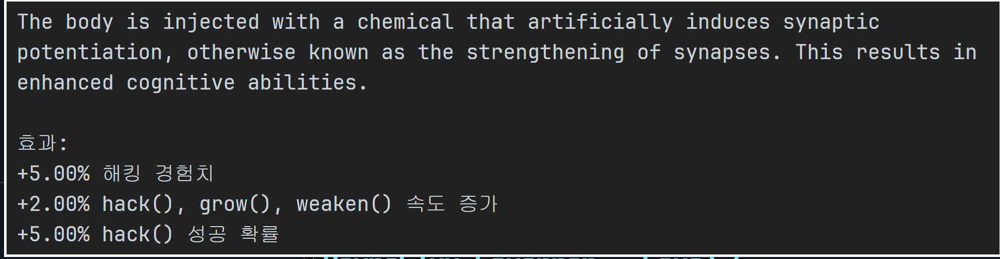

관찰:

- `효과:`가 유지된다.
- `해킹 경험치`가 유지된다.
- 1차에서 영어로 남았던 `faster hack(), grow(), and weaken()`가 `hack(), grow(), weaken() 속도 증가`로 바뀌었다.
- 1차에서 영어로 남았던 `hack() success chance`가 `hack() 성공 확률`로 바뀌었다.
- `hack()`, `grow()`, `weaken()` API 표기는 그대로 보존되었다.

스크린샷 2: Synthetic Nerve Enhancement 계열

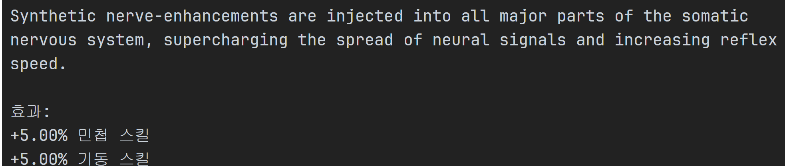

관찰:

- `dexterity skill`이 `민첩 스킬`로 바뀌었다.
- `agility skill`이 `기동 스킬`로 바뀌었다.
- 설명문과 Augmentation 이름은 원문 그대로 유지되었다.
- 효과 라벨만 좁게 번역하는 정책이 지켜졌다.

스크린샷 3: Cranial Signal Processors - Gen II

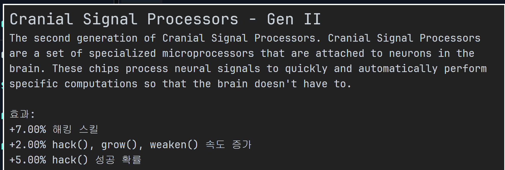

관찰:

- `해킹 스킬`, `hack(), grow(), weaken() 속도 증가`, `hack() 성공 확률`이 한 화면에서 함께 정상 표시된다.
- 긴 설명문과 효과 목록 사이의 줄간격은 깨지지 않았다.
- 숫자와 `%` 포맷도 유지되었다.

판단:

- Augmentation 효과 라벨 2차 패치는 실제 화면 검증까지 성공했다.
- 1차에서 실패처럼 보였던 항목들은 패치 범위 밖 잔류였고, 2차에서 해결되었다.
- 현재 Augmentation 효과 라벨은 “공통 라벨 + 개별 스킬/경험치 + 해킹 액션 라벨”까지 안정적으로 처리된 상태다.
- 다음 단계는 Terminal analyze 라벨 패치로 이동한다.

## 2026-06-29 - Terminal analyze 라벨 패치

목표:

- Terminal `analyze` 명령 출력의 핵심 라벨을 한국어로 바꾼다.
- 명령어/API 표기와 상태값은 보존한다.
- 한 화면의 라벨만 다루고, 터미널 전체 메시지 번역으로 확장하지 않는다.

적용한 번역:

- `Organization name:` -> `조직 이름:`
- `Root Access:` -> `루트 권한:`
- `Can run scripts on this host:` -> `이 호스트에서 스크립트 실행 가능:`
- `RAM blocked by owner:` -> `소유자가 차단한 RAM:`
- `Stasis link:` -> `Stasis 링크:`
- `Backdoor:` -> `Backdoor 설치:`
- `Required hacking skill for hack() and backdoor:` -> `hack()/backdoor 필요 해킹 레벨:`
- `Server security level:` -> `서버 보안 레벨:`
- `Chance to hack:` -> `hack() 성공 확률:`
- `Time to hack:` -> `hack() 소요 시간:`
- `Total money available on server:` -> `서버 보유 자금:`
- `Required number of open ports for NUKE:` -> `NUKE 필요 개방 포트 수:`
- `SSH/FTP/SMTP/HTTP/SQL port:` -> `SSH/FTP/SMTP/HTTP/SQL 포트:`

보존한 것:

- `hack()`, `backdoor`, `NUKE`, `SSH`, `FTP`, `SMTP`, `HTTP`, `SQL`, `RAM`
- `N/A`, `YES`, `NO`, `Open`, `Closed`

통제 확인:

- `Root Access:`와 `RAM:` 같은 짧은 라벨은 전체 번들에 여러 번 나오므로 broad 치환하지 않았다.
- 실제 source는 `this.print("...")` 또는 template literal 시작부를 포함한 analyze 전용 조각으로 잡았다.
- `Backdoor:`는 analyze 함수 안에서 두 번 출력되므로 `expectedCount: 2`로 처리했다.
- 현재 번들에는 `Time to grow`, `Time to weaken` analyze 출력 라벨이 없어 이번 패치에 포함하지 않았다.

적용 결과:

- `scripts/apply-patch.ps1 -Patch patches/terminal_analyze_labels.json` dry-run 통과
- `scripts/apply-patch.ps1 -Patch patches/terminal_analyze_labels.json -Apply` 적용 성공
- 적용 후 17개 source 조각은 모두 0회 확인
- 적용 후 target 조각은 16개가 1회, `Backdoor 설치:`가 2회 확인
- 재실행 dry-run에서 17개 operation 모두 `already-applied` 확인

다음 확인:

- 실제 Terminal에서 `analyze` 명령을 실행해 화면 표시를 확인한다.
- 일반 서버와 Backdoor/권한 상태가 다른 서버를 비교한다.
- 스크린샷을 추가한 뒤 Phase 4 완료로 본다.

## 2026-06-29 - Terminal analyze 화면 검증

목표:

- 실제 Terminal에서 `analyze`를 실행해 패치가 화면에 반영되는지 확인한다.
- 한글 라벨과 보존 대상 상태값이 같이 깨지지 않는지 확인한다.
- NeoDunggeunmo 폰트에서 터미널 라인 간격과 정렬이 무너지지 않는지 본다.

스크린샷: home 서버 analyze

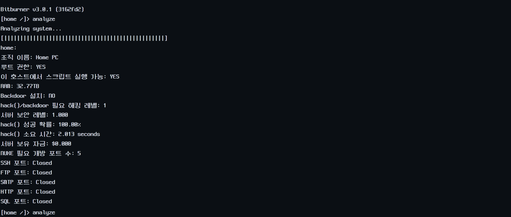

관찰:

- `조직 이름`, `루트 권한`, `이 호스트에서 스크립트 실행 가능`이 정상 표시된다.
- `Backdoor 설치`, `hack()/backdoor 필요 해킹 레벨`, `서버 보안 레벨`, `hack() 성공 확률`, `hack() 소요 시간`이 정상 표시된다.
- `서버 보유 자금`, `NUKE 필요 개방 포트 수`, `SSH/FTP/SMTP/HTTP/SQL 포트`가 정상 표시된다.
- `RAM`, `YES`, `NO`, `Closed`, `hack()`, `NUKE`, 포트명은 의도대로 보존되었다.
- 숫자, `%`, 달러 표기, `seconds` 표기는 깨지지 않았다.

판단:

- Terminal `analyze` 라벨 패치는 실제 화면 검증까지 성공했다.
- 현재 검증은 home 서버 기준이다.
- 다음에 다른 서버를 볼 때 Backdoor 설치 여부와 포트 Open 상태가 다른 케이스를 추가로 찍으면 더 좋다.

## 2026-06-29 - Hacknet 요약 라벨 패치

목표:

- 이미 검증된 Hacknet 화면 안에서 설명문 다음으로 작은 라벨 패치를 진행한다.
- 플레이어가 바로 읽는 요약 박스와 구매 버튼만 다룬다.
- `Level:`, `RAM:`, `Cores:`처럼 다른 화면/컴포넌트에도 많이 나오는 라벨은 제외한다.

적용한 번역:

- `Hacknet Summary` -> `Hacknet 요약`
- `Money Spent:` -> `사용한 돈:`
- `Money Produced:` -> `벌어들인 돈:`
- `Production Rate:` -> `생산 속도:`
- `Purchase Hacknet Node -` -> `Hacknet Node 구매 -`

통제 확인:

- 위 5개 source는 현재 Bitburner 3.0.1 번들에서 각각 정확히 1회만 등장했다.
- `Level:`은 179회, `RAM:`은 48회, `Cores:`는 27회 등장하므로 broad 치환하지 않았다.
- `MAX LEVEL`, `MAX RAM`, `MAX CORES`는 Hacknet Node와 Hacknet Server 문맥이 섞일 수 있어 다음 별도 패치로 남겼다.

적용 결과:

- `scripts/apply-patch.ps1 -Patch patches/hacknet_summary_labels.json` dry-run 통과
- `scripts/apply-patch.ps1 -Patch patches/hacknet_summary_labels.json -Apply` 적용 성공
- 적용 후 5개 source 조각은 모두 0회 확인
- 적용 후 5개 target 조각은 모두 1회 확인
- 재실행 dry-run에서 5개 operation 모두 `already-applied` 확인

다음 확인:

- 실제 Hacknet Nodes 화면을 다시 열어 요약 박스와 구매 버튼 표시를 확인한다.
- 스크린샷이 추가되면 이 항목 아래에 화면 검증 결과를 이어 쓴다.

## 2026-06-29 - Hacknet 요약 라벨 화면 검증

스크린샷: Hacknet Summary

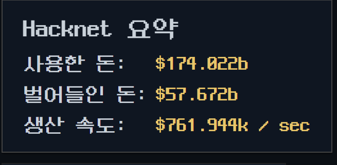

관찰:

- `Hacknet 요약` 제목이 정상 표시된다.
- `사용한 돈:`, `벌어들인 돈:`, `생산 속도:` 라벨이 정상 표시된다.
- 금액, `/ sec`, 색상 강조는 기존 포맷을 유지한다.
- NeoDunggeunmo 전체 UI 폰트에서도 숫자와 한글 라벨 정렬이 크게 무너지지 않는다.
- 구매 버튼 영역은 스크린샷 하단에 일부만 보여서 별도 넓은 화면에서 추가 확인할 수 있다.

판단:

- Hacknet 요약 박스 라벨은 실제 화면 검증까지 성공했다.
- 같은 화면 안에서 다음으로 넓힐 후보는 Hacknet Node 카드 라벨이지만, `Level:`, `RAM:`, `Cores:`는 broad 출현 수가 많으므로 문맥 제한 패치가 필요하다.

## 2026-06-29 - Hacknet Node 카드 라벨 패치

목표:

- Hacknet 요약 박스 다음으로 같은 화면 안의 Node 카드 라벨을 작게 확장한다.
- 전역 라벨 오염을 피하기 위해 broad string이 아니라 React minified context 조각을 source로 사용한다.

적용한 번역:

- `Production:` -> `생산량:`
- `Level:` -> `레벨:`
- `Cores:` -> `코어:`
- `MAX LEVEL` -> `최대 레벨`
- `MAX RAM` -> `최대 RAM`
- `MAX CORES` -> `최대 코어`

보존한 것:

- `RAM:`은 그대로 둔다.
- Hacknet Node 이름, 금액, 초당 생산량, 업그레이드 비용 표기는 그대로 둔다.

통제 확인:

- `Production:`은 전체 번들에 16회, `Level:`은 179회, `RAM:`은 48회, `Cores:`는 27회 등장했다.
- 따라서 `r.createElement(m.A,null,"...")`와 `r.createElement(d.A,{disabled:!0},"...")` 형태의 Hacknet Node 카드 전용 조각으로 제한했다.
- 제한된 source 6개는 각각 정확히 1회만 매치되었다.

적용 결과:

- `scripts/apply-patch.ps1 -Patch patches/hacknet_node_card_labels.json` dry-run 통과
- `scripts/apply-patch.ps1 -Patch patches/hacknet_node_card_labels.json -Apply` 적용 성공
- 적용 후 6개 source 조각은 모두 0회 확인
- 적용 후 6개 target 조각은 모두 1회 확인
- 재실행 dry-run에서 6개 operation 모두 `already-applied` 확인

다음 확인:

- 실제 Hacknet Nodes 화면에서 Node 카드 표시를 확인한다.
- 특히 `최대 레벨`, `최대 RAM`, `최대 코어`는 최대치 상태의 노드에서만 보이므로 스크린샷 조건을 맞춰 확인한다.

## 2026-06-29 - Hacknet Node 카드 화면 검증

스크린샷: Hacknet Node 카드

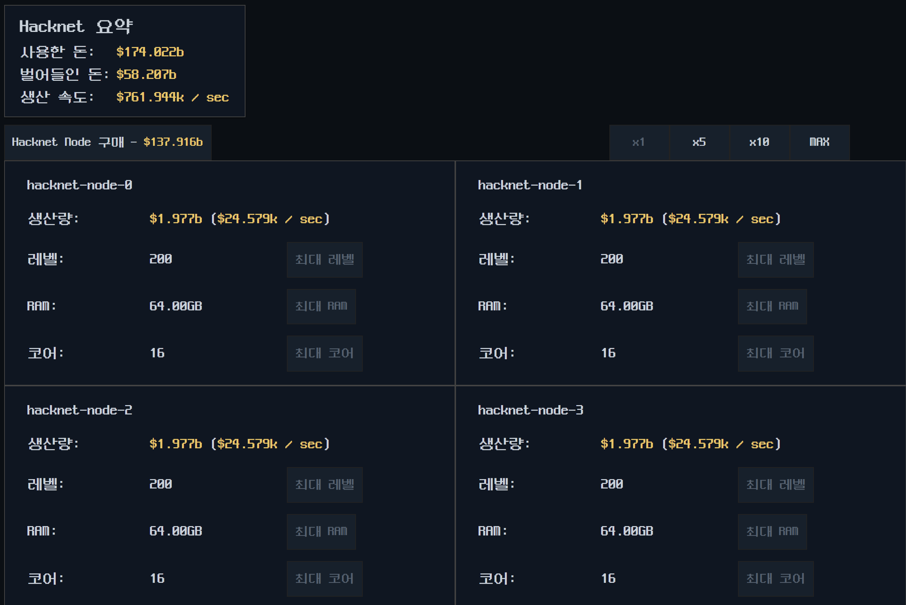

관찰:

- `생산량:`, `레벨:`, `코어:`가 정상 표시된다.
- `RAM:`은 의도대로 원문 약어를 유지한다.
- 최대치 상태 버튼이 `최대 레벨`, `최대 RAM`, `최대 코어`로 표시된다.
- Node 이름, 금액, 초당 생산량, 수치 포맷은 유지된다.
- 버튼 폭 안에 한글 라벨이 들어가며 큰 UI 깨짐은 보이지 않는다.

판단:

- Hacknet Node 카드 라벨 패치는 실제 화면 검증까지 성공했다.

## 2026-06-29 - Options System 라벨 패치

목표:

- Options 화면에서 가장 먼저 보이는 System 페이지의 입력/슬라이더/스위치 라벨을 한글화한다.
- 왼쪽 탭과 하단 작업 버튼은 별도 패치로 분리한다.

기준 스크린샷:

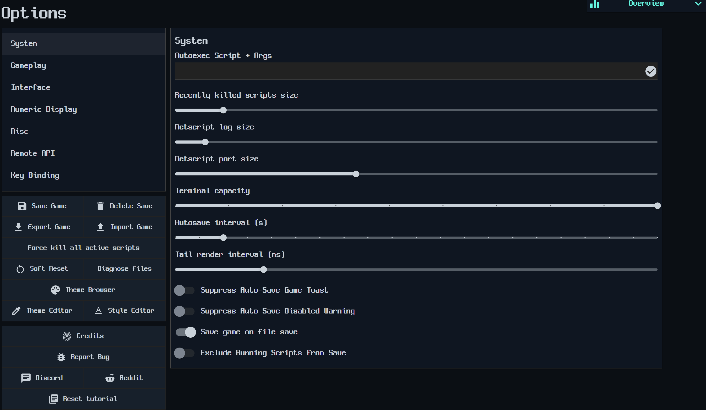

적용한 번역:

- `Autoexec Script + Args` -> `Autoexec 스크립트 + 인수`
- `Recently killed scripts size` -> `최근 종료 스크립트 크기`
- `Netscript log size` -> `Netscript 로그 크기`
- `Netscript port size` -> `Netscript 포트 크기`
- `Terminal capacity` -> `터미널 용량`
- `Autosave interval (s)` -> `자동 저장 간격 (초)`
- `Tail render interval (ms)` -> `Tail 렌더 간격 (ms)`
- `Suppress Auto-Save Game Toast` -> `자동 저장 알림 숨기기`
- `Suppress Auto-Save Disabled Warning` -> `자동 저장 비활성화 경고 숨기기`
- `Save game on file save` -> `파일 저장 시 게임 저장`
- `Exclude Running Scripts from Save` -> `저장에서 실행 중인 스크립트 제외`

통제 확인:

- `Options`, `System`, `Interface`, `Misc` 등은 전역 출현 수가 많아 이번 패치에서 제외했다.
- System 페이지 내부 label/text prop만 source로 삼았다.
- `Recently killed scripts size`는 전체 번들에 3회 나오지만, `label:"Recently killed scripts size"`는 1회라 이 문맥으로 제한했다.

적용 결과:

- dry-run에서 11개 operation 모두 `sourceCount=1` 확인
- `-Apply` 적용 성공
- 적용 후 11개 target 조각 모두 1회 확인
- 재실행 dry-run에서 11개 operation 모두 `already-applied` 확인

다음 확인:

- 실제 Options > System 화면을 다시 열어 한글 라벨 표시와 줄바꿈을 확인한다.
- 적용 후 스크린샷이 추가되면 화면 검증 결과를 이어 쓴다.

## 2026-06-29 - Options System 라벨 화면 검증

스크린샷:

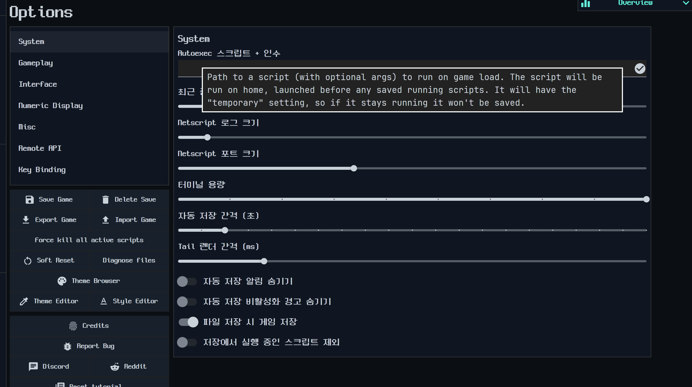
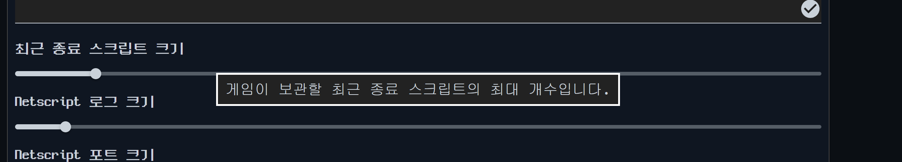
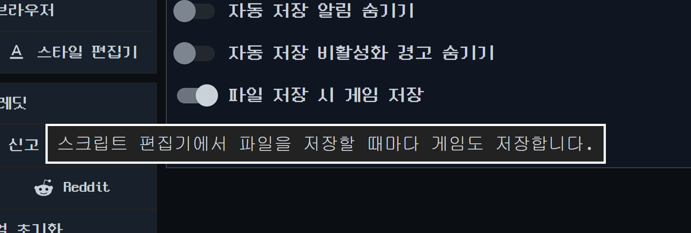

관찰:

- Options 제목과 왼쪽 탭 일부가 한국어로 표시된다.
- System 페이지의 주요 라벨이 한국어로 표시된다.
- `최근 종료 스크립트 크기`, `파일 저장 시 게임 저장` 툴팁은 한국어로 정상 표시된다.
- 화면 스크린샷 기준 `자동 저장 비활성화 경고 숨기기` 툴팁은 영어로 남아 있어 후속 보정 대상으로 기록했다.

판단:

- System 라벨 1차 패치는 성공했지만, 설명문/툴팁은 별도 sweep이 필요했다.

## 2026-06-29 - Options 라벨/버튼/Key Binding 확장 패치

추가한 manifest:

- `patches/options_remaining_texts.json`
- `patches/options_sidebar_buttons.json`
- `patches/options_keybinding_texts.json`

적용 범위:

- Options 루트 제목과 왼쪽 탭 표시명
- Gameplay, Interface, Numeric Display, Misc, Remote API, Key Binding 페이지 제목/라벨 일부
- 하단 작업 버튼: 저장, 삭제, 내보내기/가져오기, 강제 종료, 소프트 리셋, 파일 진단, 테마/스타일 편집, 크레딧, 버그 신고, 튜토리얼 초기화
- Key Binding 보조 텍스트: 사용 방법, 공통 단축키, Bash 단축키, 충돌/초기화 관련 라벨

스크린샷:

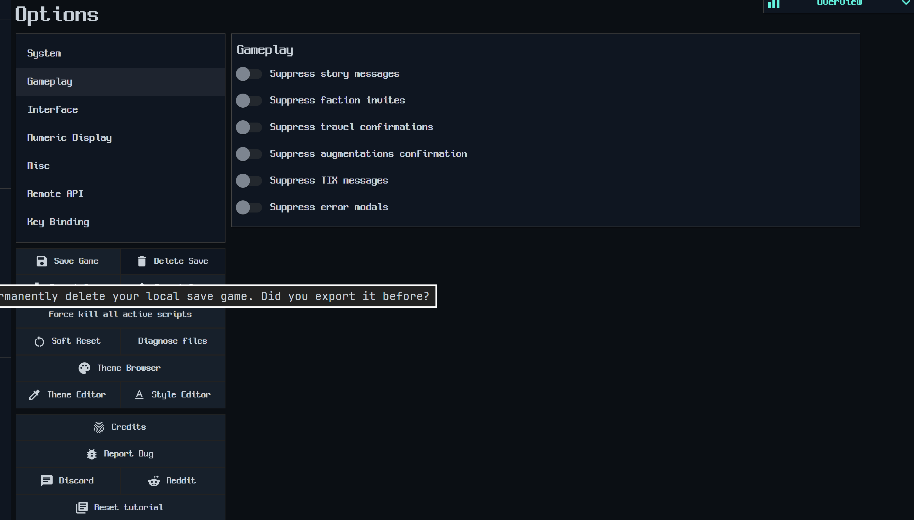
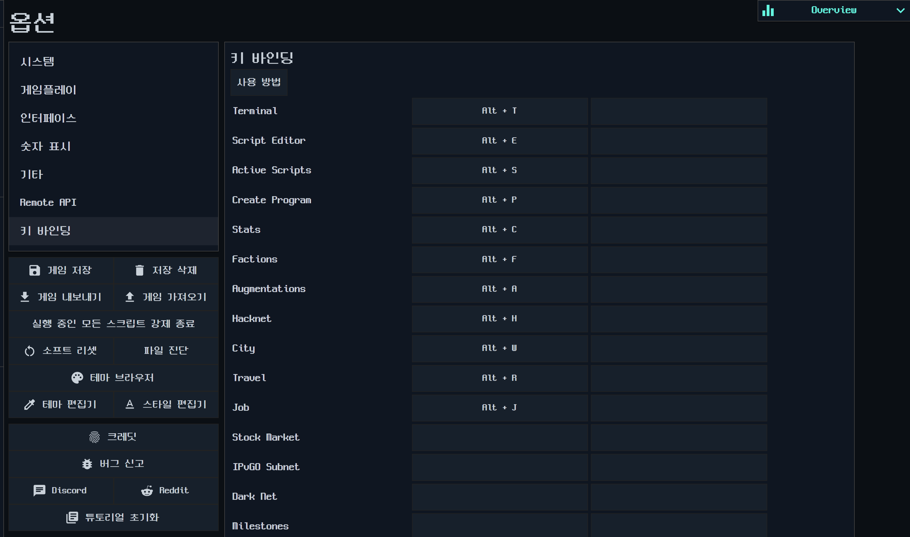
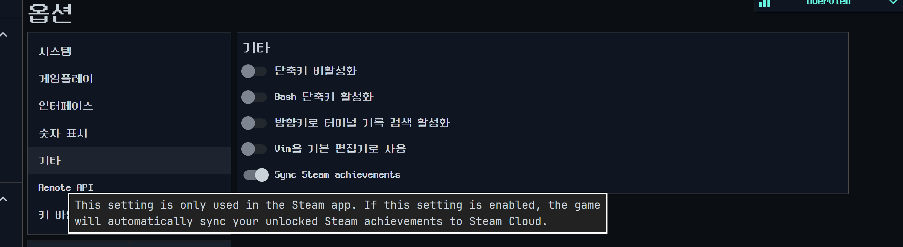

확인된 미완료:

- Key Binding 표의 동작 이름(`Terminal`, `Script Editor`, `Active Scripts` 등)이 영어로 남았다.
- Misc의 `Sync Steam achievements` 라벨과 툴팁이 영어로 남았다.
- System의 `자동 저장 비활성화 경고 숨기기` 툴팁이 영어로 남았다.
- Options의 설명문 계열은 라벨보다 source 형태가 다양해서 별도 보정 manifest가 필요했다.
- 이 스크린샷들은 최종 성공 화면이 아니라 잔여 문구를 확인하기 위한 중간 기록이다.

판단:

- 라벨/버튼 확장은 성공했지만, Options 전체 완료로 보기에는 부족했다.
- 이후 패치는 스크린샷 기반 잔여 문구를 실제 `main.bundle.js` literal count로 다시 잡는 방식으로 진행했다.

## 2026-06-29 - Options 툴팁 보정 및 final sweep

추가한 manifest:

- `patches/options_tooltip_completion.json`
- `patches/options_tooltip_final_sweep.json`

보정한 주요 영역:

- System: Autoexec 설명, Netscript 로그/포트 크기, 터미널 용량, Tail 렌더 간격, 자동 저장 토스트/비활성화 경고, 실행 중 스크립트 저장 제외 툴팁
- Misc: 단축키 비활성화, Bash 단축키, 방향키 터미널 기록 검색, Vim 기본 편집기, Steam 도전 과제 동기화 라벨/툴팁
- Gameplay: 스토리 메시지, Faction 초대, 여행 확인, Augmentation 구매 확인, 오류 모달, Bladeburner 팝업 설명문
- Interface: ASCII 아트, 텍스트 효과, Overview 진행 바, 중간 시간 단위 표시, 타임스탬프 설명문
- Numeric Display: 공학 표기, 지수 표기, 천 단위 구분, 소수 자릿수, 소수 끝 0, GiB/GB 설명문
- Remote API: 호스트명, IPv6 안내, 포트, 재연결 지연, wss, 연결 버튼, 문서 버튼
- Key Binding: 표의 동작 이름 표시를 렌더 시점 매핑으로 한국어화

실패와 보정:

- `options_tooltip_completion.json` 초안은 소스맵의 줄바꿈 포함 원문을 사용해 5개 operation이 `expectedCount=0`으로 실패했다.
- 실제 minify된 `main.bundle.js`에서는 같은 설명문이 한 줄 문자열 또는 single quote 문자열로 존재했다.
- 실패한 manifest는 실제 번들 literal count 기반으로 재작성했고, 26개 operation 모두 dry-run을 통과했다.
- 이후 추가 잔여 검색에서 Gameplay/Interface/Numeric/Remote API 설명문 17개가 더 발견되어 `options_tooltip_final_sweep.json`으로 분리했다.

검증:

- `options_tooltip_completion.json`: dry-run 26개 통과, apply 성공, 재 dry-run에서 26개 모두 `already-applied` 확인
- `options_tooltip_final_sweep.json`: dry-run 17개 통과, apply 성공, 재 dry-run에서 17개 모두 `already-applied` 확인
- 문제로 확인된 원문들은 적용 후 모두 0회 확인했다.
- `If this is set` 잔여 3건은 Options 창이 아니라 Dark Web/Active Scripts 문맥으로 확인되어 이번 scope에서 제외했다.

남은 확인:

- 실제 게임을 새로고침한 뒤 Options의 System, Gameplay, Interface, Numeric Display, Misc, Remote API, Key Binding 탭을 한 번씩 열어 시각 검증한다.
- 새 성공 스크린샷이 추가되면 이 항목 아래에 연결한다.

## 2026-06-29 - Options 최종 잔여 4곳 보정

스크린샷:

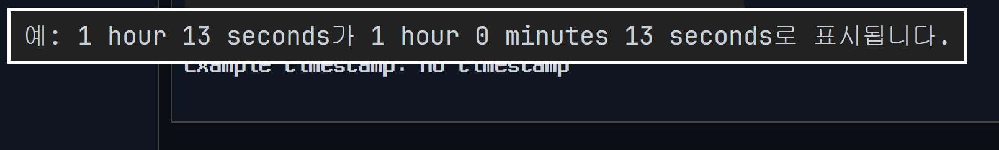
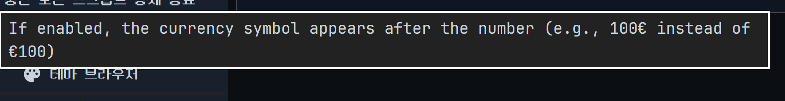
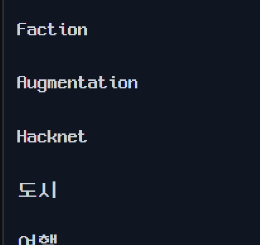
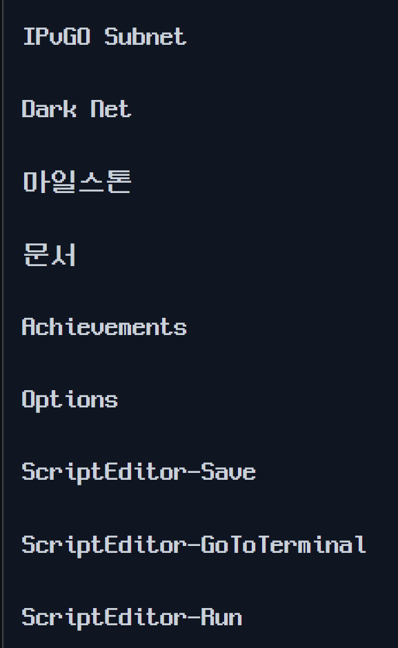
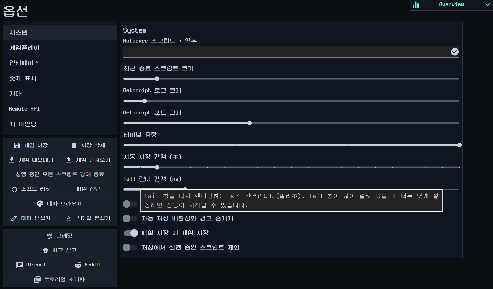

확인된 잔여:

- Interface 시간 단위 예시에서 `1 hour 13 seconds`, `1 hour 0 minutes 13 seconds`가 영어 단위로 남았다.
- Numeric Display의 통화 기호 위치 툴팁이 영어로 남았다.
- Key Binding 표에서 `Faction`, `Augmentation`, `Achievements`, `Options`가 영어로 남았다.
- Key Binding 표에서 `ScriptEditor-Save`, `ScriptEditor-GoToTerminal`, `ScriptEditor-Run` 내부 action id가 그대로 표시되었다.

적용한 보정:

- `patches/options_final_visual_fixes.json` 추가
- 시간 예시: `예: 1시간 13초가 1시간 0분 13초로 표시됩니다.`
- 통화 기호 툴팁: `활성화하면 통화 기호가 숫자 뒤에 표시됩니다(예: €100 대신 100€).`
- Key Binding 표시 매핑 추가: `팩션`, `증강`, `업적`, `옵션`, `스크립트 저장`, `터미널로 이동`, `스크립트 실행`

검증:

- dry-run에서 3개 operation 모두 `sourceCount=1` 확인
- apply 성공
- 재 dry-run에서 3개 operation 모두 `already-applied` 확인
- 적용 후 기존 원문은 0회, 새 target은 각 1회 확인

판단:

- 확인한 Options 잔여 4곳은 정적 검증 기준으로 처리 완료했다.
- 화면 재확인 결과 길이 문제와 새 잔여가 없어 Options 묶음을 완료로 본다.

## 2026-06-29 - Options 완료 화면 확인

스크린샷:

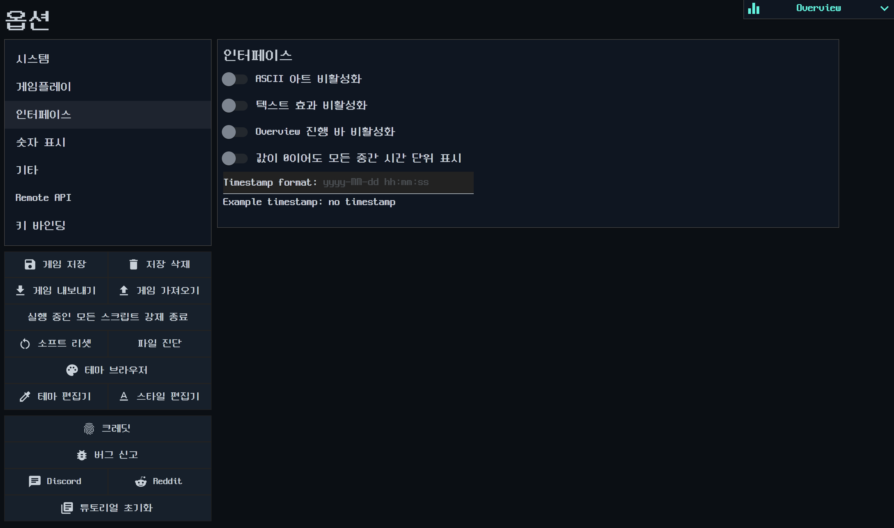

확인:

- Options 화면의 라벨과 주요 설명문이 누락 없이 한글로 렌더링되었다.
- Interface 탭에서 라벨, 스위치, 입력 보조 텍스트가 정상 표시된다.
- 길이 문제나 새 잔여 문구는 보이지 않는다.

판단:

- Options 창 라벨/작업 버튼/주요 툴팁 설명문 묶음은 화면 확인 기준으로 완료했다.
- 다음 단계는 Options 범위 밖의 Dark Web/Active Scripts 단발 툴팁 또는 Active Scripts 라벨 패치다.
