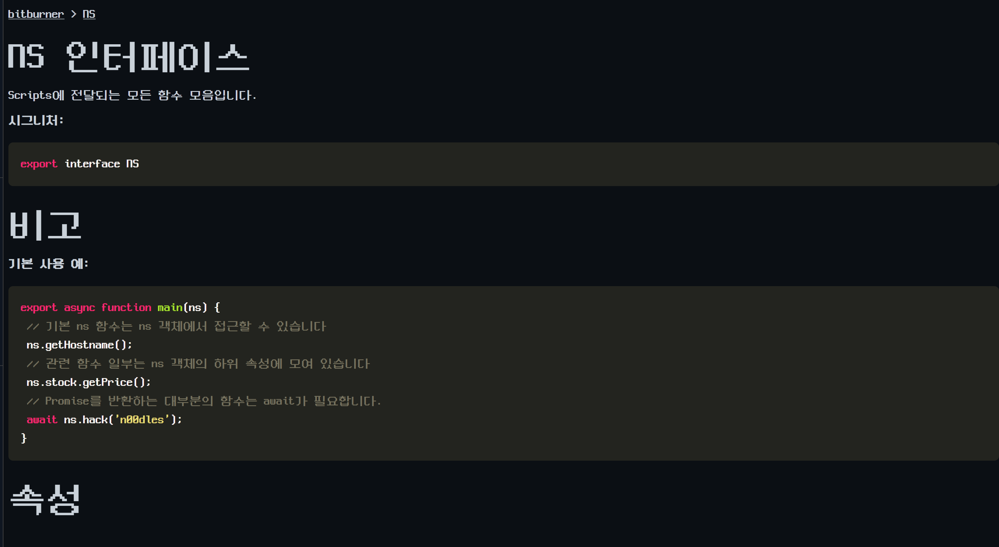
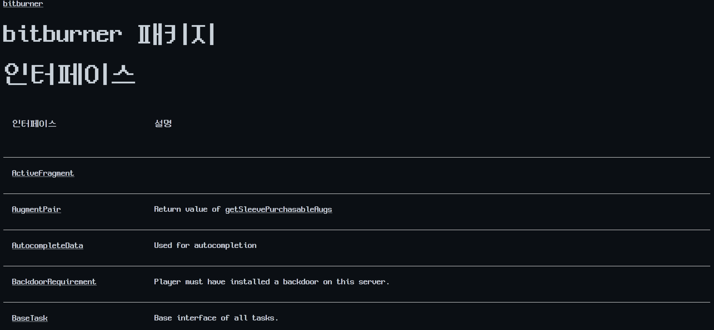
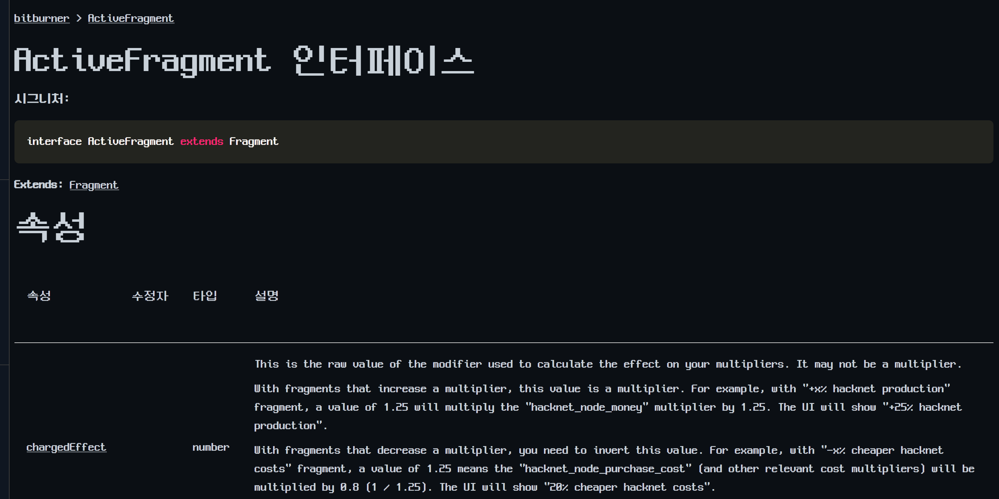
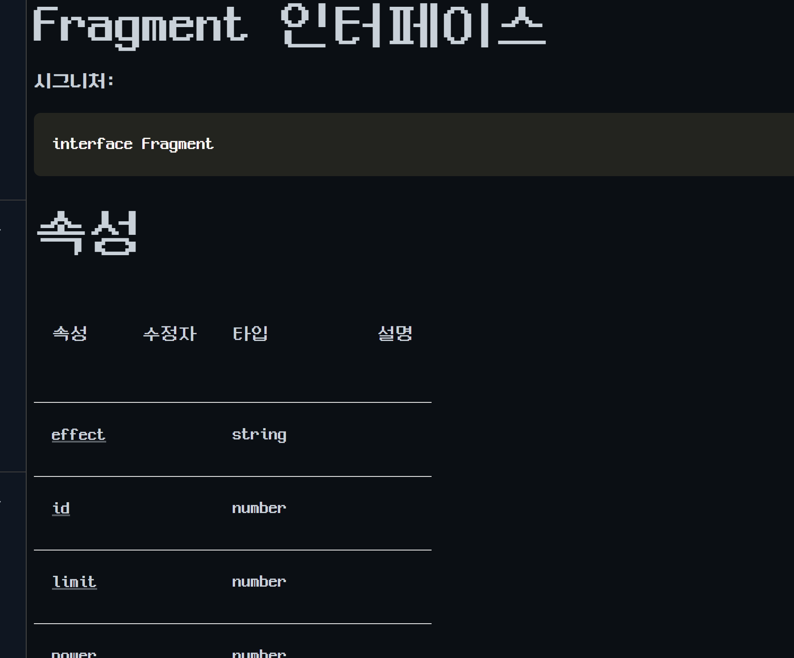
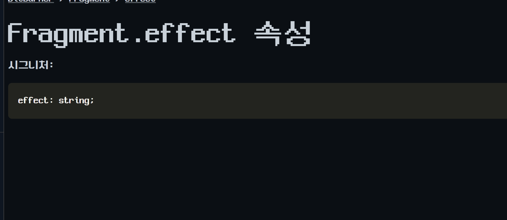
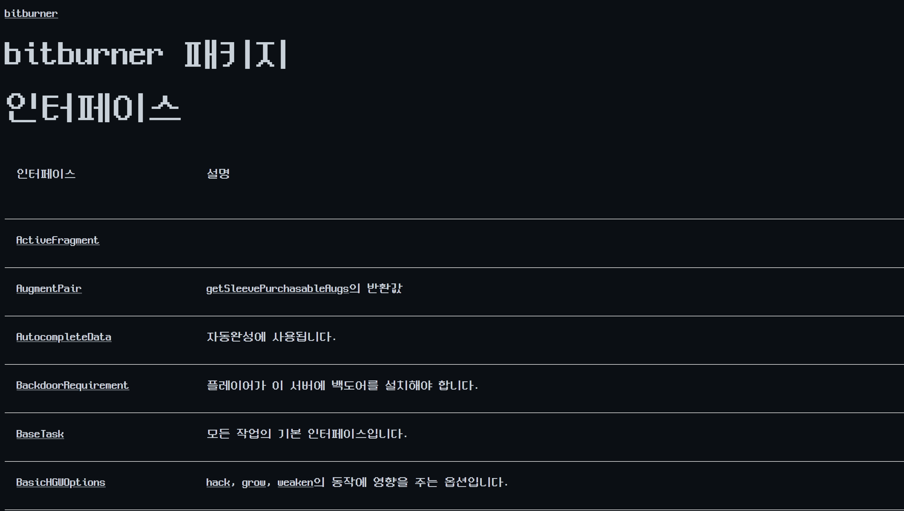

# API 문서 트리 작업 로그

## 분리 이유

NS/API 문서 트리는 일반 Documentation 문서보다 구조가 훨씬 깊다. 홈 화면에서 보이는 `NS` 문서 하나로 끝나지 않고, `bitburner package` 인덱스, 인터페이스 목록, 타입 목록, 각 속성/메서드 상세 페이지가 계속 하위 문서로 이어진다.

따라서 기존 `08_experiment_log.md`에 계속 붙이면 실험 로그가 너무 커지고, 어떤 문자열이 화면 문서인지 API reference 구조인지 구분하기 어려워진다. API 문서 트리는 이 파일에서 별도 트랙으로 기록한다.

## 현재 처리 범위

| 영역 | manifest | 방식 | 상태 |
| --- | --- | --- | --- |
| NS 개요 | `patches/documentation_api_ns_overview.json` | 단일 개요 페이지 본문 치환 | 검증 완료 |
| `NS.args`/`ScriptArg` | `patches/documentation_api_ns_args_scriptarg.json` | 작은 상세 페이지 2개 치환 | 검증 완료 |
| API 공통 구조 | `patches/documentation_api_common_structure.json` | 반복 제목/표/라벨을 `regexReplace`로 제한 치환 | 검증 완료 |
| package 대표 설명문 | `patches/documentation_api_package_visible_descriptions.json` | package 인덱스의 화면 노출 설명문 치환 | 검증 완료 |
| 패처 확장 | `scripts/apply-patch.ps1` | `regexReplace` operation 추가 | 검증 완료 |

공통 검증 순서:

`dry-run -> apply -> node --check -> 재 dry-run -> 화면 확인`

스크린샷:

## 작업 방식

1. 먼저 실제 화면에서 문서의 위치를 확인한다.
2. 화면이 일반 Documentation인지, API reference인지 분리한다.
3. 번들에서 원문 문자열의 출현 수를 확인한다.
4. 문자열을 네 가지 유형으로 나눈다.

- 단일 문서 본문: `NS` 개요처럼 한 페이지가 하나의 큰 markdown 문자열로 들어 있는 경우
- 공통 생성 구조: `interface`, `property`, `type`, `Signature`, `Properties`, `Methods`, `Example`처럼 API 문서 생성기가 반복해서 만드는 구조
- 목록 설명문: `bitburner package` 인덱스의 `Description` 열처럼 짧은 설명이 많이 나열되는 경우
- 상세 속성/메서드 문서: `NS.args property`, `Fragment.effect property`처럼 개별 API 항목으로 들어가는 경우

5. 단일 문서 본문과 짧은 설명문은 가능한 한 `replace`를 사용한다.
6. 공통 생성 구조처럼 같은 패턴이 여러 페이지에서 반복되는 경우에만 `regexReplace`를 사용한다.
7. 모든 manifest는 `expectedCount` 또는 `targetPattern`으로 실패 조건을 명시한다.
8. 적용 후에는 `node --check`를 반드시 통과시킨다.
9. 재 dry-run에서 `already-applied` 상태와 `targetCount`를 확인한다.
10. 마지막으로 실제 화면 스크린샷으로 줄바꿈, 제목, 표 라벨, 설명문을 확인한다.

## `regexReplace`를 추가한 이유

API 문서의 공통 구조는 단순한 1회 치환으로 다루기 어렵다. 예를 들어 `property`, `interface`, `Signature`, `Description`, `Parameters`, `Returns` 같은 문자열은 문서 생성기가 많은 하위 페이지에 반복해서 넣는다.

이때 무작정 넓은 문자열을 치환하면 코드, 타입명, 실제 API 식별자까지 건드릴 위험이 있다. 그래서 패처에 `regexReplace`를 추가하고, 각 op마다 다음 조건을 두었다.

- `expectedCount`: 예상한 원문 매치 수와 다르면 쓰기 전 중단
- `targetPattern`: 이미 적용된 상태를 감지할 수 있는 정규식
- `allowExistingTarget`: 원문이 0개이고 target이 이미 존재하면 already-applied로 처리
- `allowRemainingSource`: 같은 원문이 다른 문맥에 남아도 되는 경우만 명시적으로 허용

## 보존 원칙

다음 항목은 번역하지 않는다.

- 함수명: `hack`, `grow`, `weaken`, `scp`, `exec`, `scan`
- namespace/API명: `ns`, `NS`, `ns.stock`, `ns.go`, `ns.dnet`
- 타입명/인터페이스명: `ScriptArg`, `ActiveFragment`, `Fragment`, `BasicHGWOptions`
- 파일명과 명령어: `example.js`, `run`, `home`
- 코드 블록과 시그니처 내부의 TypeScript 문법

설명문은 한국어로 옮기되, API 식별자는 원문 그대로 남겨 검색성과 코드 연결성을 유지한다.

## 실패 위험과 대응

API 문서 트리는 일반 문서보다 하위 링크가 많아서 실패가 늦게 발견될 수 있다. 그래서 조기 실패를 우선한다.

- quote escaping 문제: `"`, `'`, 백틱, literal `\n`을 번들 실제 문자열 기준으로 확인한다.
- 중복 문자열 문제: 같은 설명문이 package 목록과 상세 페이지 양쪽에 있을 수 있으므로 `expectedCount`를 실제 값으로 둔다.
- 과도한 broad 치환 문제: API 식별자와 일반 설명문이 섞이는 문자열은 regex 범위를 좁힌다.
- 이미 적용된 상태 문제: `targetPattern`으로 재 dry-run에서 `already-applied`를 확인한다.
- 부팅 실패 문제: 적용 직후 `node --check resources/app/dist/main.bundle.js`를 필수로 실행한다.

## 이번 판단

NS/API 문서 트리는 완전 한글화 가능성이 높지만, 일반 Documentation보다 더 세밀한 계층 관리가 필요하다. 특히 package 인덱스와 상세 페이지가 서로 연결되어 있어서 “큰 페이지 하나 번역”이 아니라 “구조 레이어 -> 대표 설명문 -> 자주 쓰는 namespace -> 개별 메서드” 순서가 안전하다.

현재는 NS 개요, `NS.args`, `ScriptArg`, API 공통 구조, package 대표 설명문까지 검증했다. 다음부터는 API 하위 문서를 기능별 묶음으로 확장한다.

## 다음 후보

1. package 인덱스의 대표 설명문 추가 번역
2. 고빈도 NS 메서드 상세 문서: `hack`, `grow`, `weaken`, `scp`, `exec`, `scan`, `getServer*`
3. namespace 단위 문서: `stock`, `go`, `dnet`, `sleeve`, `gang`, `corporation`
4. 화면에서 자주 보이는 인터페이스/타입 상세 문서
5. 진행도에 따라 해금되는 API 문서 잔여 확인

